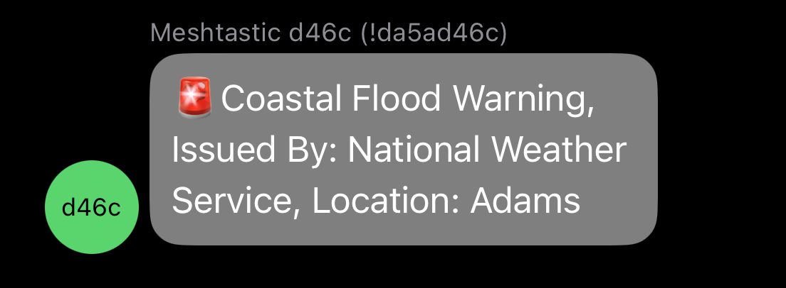

# Meshtastic SAME EAS Alerter


<a href="https://www.weather.gov/" class="image-container">
    
</a>

<a href="https://www.fema.gov/emergency-managers/practitioners/integrated-public-alert-warning-system/public/emergency-alert-system" class="image-container">
    
</a>

<a href="https://Meshtastic.org" class="image-container">
    
</a>

The Meshtastic SAME EAS Alerter is a lightweight tool designed to forward warnings, emergencies, or statements sent over the air to a local Meshtastic network. It operates without needing a WiFi connection. The setup involves connecting the hosting computer to an RTL SDR via USB and to a running Meshtastic node via serial or TCP.



## 💿 Installation
# ATTENTION: For the newest version you must install the python CLI  
Installation example for Raspbian
1. Install rtl_fm.  
   follow these [instructions](https://fuzzthepiguy.tech/rtl_fm-install/)
2. Install the Meshtastic Python CLI  
   Follow these [instructions](https://meshtastic.org/docs/software/python/cli/installation/)
3. Install Meshtastic-SAME-EAS-Alerter
````
# Download the updated .deb file
wget https://github.com/RCGV1/Meshtastic-SAME-EAS-Alerter/releases/download/v<VERSION_NUMBER_HERE>/Meshtastic-SAME-EAS-Alerter_<VERSION_NUMBER_HERE>_arm64.deb

# Install the .deb package
sudo dpkg -i Meshtastic-SAME-EAS-Alerter_<VERSION_NUMBER_HERE>_arm64.deb

# Fix any dependency issues
sudo apt-get install -f
````

Other operating systems may have a different installation


## 🖋️ Usage
### By default the alerter will find a connected node that is connected via serial or on local host

### RTL FM input
- You must pass in the input from an rtl fm stream
- For a detailed installation guide of rtl_fm check out the Installation instructions
- Set the desired frequency to the nearest National Weather Service radio station typically in the 162.40 to 162.55 MHz range
```
rtl_fm -f <FREQUENCY_IN_HZ_HERE> -s 48000 -r 48000 | Meshtastic-SAME-EAS-Alerter
```
> The frequency input is in Hz not MHz

### help
```
Meshtastic-SAME-EAS-Alerter --help
```

### host
Currently there is a issue with the reliability of TCP, please use a serial connection if possible
- Enter the address of the TCP host to connect to, in the form of IP:PORT
```
Meshtastic-SAME-EAS-Alerter --host <TCP_HOST_HERE>
```

### alert channel  
- Input the channel number that alerts will be sent to  
- By default, (if nothing is provided) alerts will be sent to channel number 0  
```
Meshtastic-SAME-EAS-Alerter --alert-channel <CHANNEL_NUMBER_HERE>
```

### test channel  
- Input the channel number that test messages will be sent to  
  - Usually test messages are transmitted weekly from the weather service station  
  - These messages can help you tell if your system is working but they can be annoying as they happen often  
- By default, (if nothing is provided) test messages will be ignored  
```
Meshtastic-SAME-EAS-Alerter --test-channel <CHANNEL_NUMBER_HERE>
```

### sample rate
- Input the sampling rate of the input
- Do not modify this if you do not know what you are doing
- Default is 48000
```
Meshtastic-SAME-EAS-Alerter --rate <SAMPLING_RATE_HERE>
```

### Full example
- You need both a Meshtastic serial port passed as an arg and rtl fm to run this
- Alert channel and test channel are optional (see above)
- By default (if host is not provided) the alerter will find a node that is connected via serial or on local host
````
rtl_fm -f <FREQUENCY_IN_HZ_HERE> -s 48000 -r 48000 | Meshtastic-SAME-EAS-Alerter --alert-channel <CHANNEL_NUMBER_HERE> --test-channel <CHANNEL_NUMBER_HERE>
````
or
````
rtl_fm -f <FREQUENCY_IN_HZ_HERE> -s 48000 -r 48000 | Meshtastic-SAME-EAS-Alerter --host <TCP_HOST_HERE> --alert-channel <CHANNEL_NUMBER_HERE> --test-channel <CHANNEL_NUMBER_HERE>
````
> Remember to replace the placeholder values

# 📓 TODO
PRs are welcome
- [ ] Canadian Location Codes and marine
- [x] Connect to a node over TCP
- [ ] Live audio to text transcription for forwarding instructions sent after the SAME header

# 📇 Contact
If you need assistance deploying an alerter feel free to contact me
- Discord: RCGV_
- Email: Benjaminfaer@gmail.com

